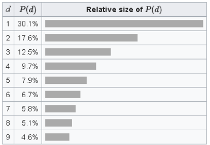

# Projeto Final 

## Fraude

* Fraude é um problema Global
* Em média, $5%$ do faturamento das empresas é perdido em fraudes
* A ciência de dados tem tido um papel fundamental no combate e prevenção de fraudes

## Lei de Benford

* Lei Estatística
* Trata da distribuição esperada dos dígitos de números gerados naturalmente
    * Exemplo: contas a pagar
* Primeiro digito (Dígito Mais a Esquerda)
   
* Distribuição Esperada

## Não Conformidade

* Não conformidade é quando a proporção encontrada é diferente da proporção esperada
* Pode significar:
    * Fraude
    * Alterações de Dados
    * Erros Sistêmicos
    * Etc.
    