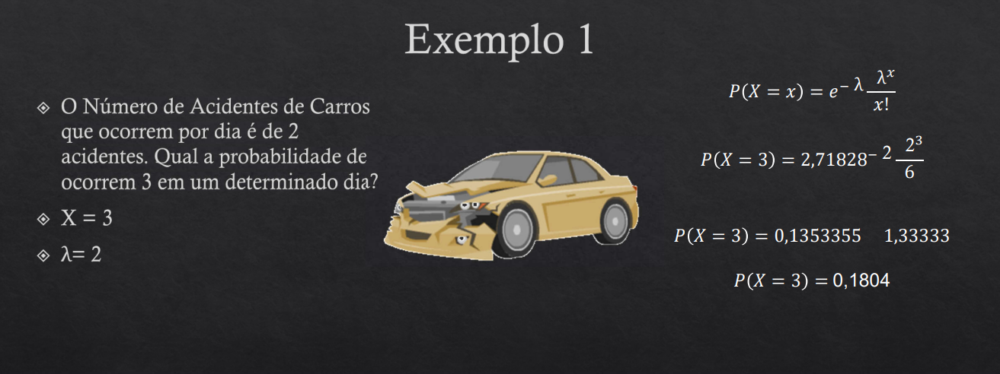

# Distribuição de Poisson

* Mede a probabilidade da ocorrência de eventos em intervalos de tempo
* Os eventos a cada intervalo devem ser independentes

* Fórmula

    * $P(X = x) = e^{-\lambda}\frac{\lambda^{x}}{x!}$
    * $x =$ número deeventos que estão sendo calculados
    * $\lambda =$ número médio de eventos que ocorre por intervalo
    * $e =$ constante = $2.71828$

    