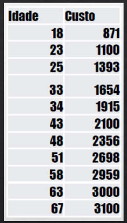
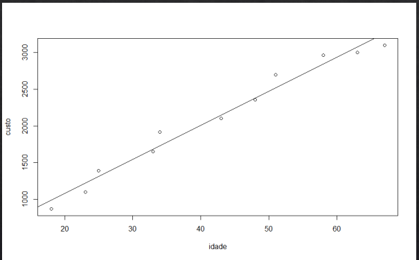
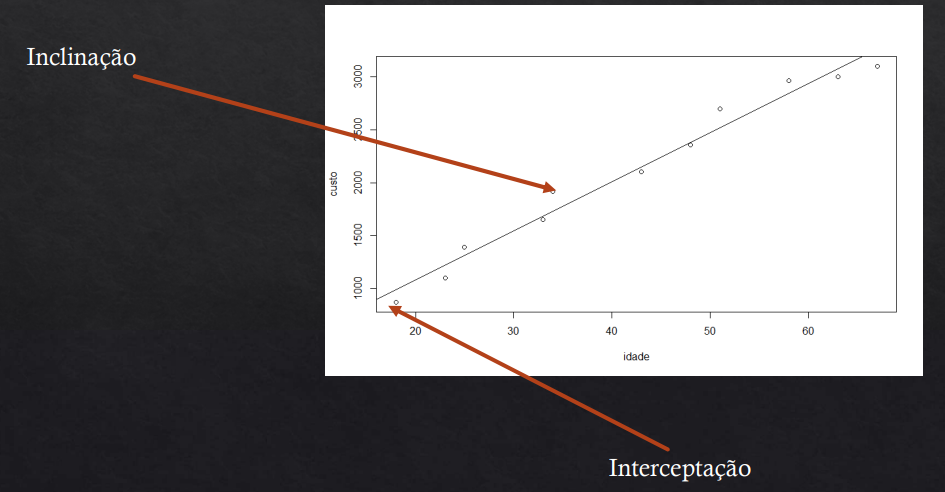

# Regressão Linear

* Existe uma vasta área da Ciência de Dados que utiliza funções estatísticas para, a partir de dados passados, prever um evento futuro ou classificar algo;
* Regressão Linear Simples:
    
    * Tendo duas variáveis numéricas relacionadas, podemos fazer previsões de valores ainda não conhecidaos:
    * Exemplo:

        * Você coleta dados sobre a venda de casacos **(Variável Dependente)** e a temperatura **(Variável Independente)**. Em um determinado dia, você verifica a temperatura e pode ter uma estimativa de quantos casacos vai vender!
        * Você quer estimar qual o custo de um paciente vai gerar para a operadora de um plano de saúde...
        * Você quer estimar quanto vai precisar investir para abrir uma franquia.
    
    * Variável que eu quero prever: Dependente $(Y)$
    * Variável que uso para prever: Independente $(X)$

    * Na Regressão Linear Simples, temos uma variável dependente e uma variável Independente
    * Na Regressão Linear Múltipla podemos ter $n$ variáveis independentes para prever uma variável dependente

* Como funciona?

    * Plano de Saúde:
    * Você quer estimar qual o custo que um cliente vai gerar para a operadora de um plano de saúde de acordo com sua idade
    * Custo: variável dependente $(Y)$
    * Idade: variável independente $(X)$ 

    

        
    

 
 Qual vai ser o custo para o plano de saúde de um cliente com $54$ anos?
 
  

    
  

  Idade é a variável independente $(X)$ e custo é a variável dependente $(Y)$

  * Como é calculado?

    * Precisamos criar um modelo - (linha de melhor ajuste)
    * O modelo é construído a partir dos dados Históricos
    * Depois de pronto, o modelo recebe como entrada os dados que eu quero prever (idade do cliente) e sua saída deve ser a previsão (custo do cliente para o plano de saúde)

* Como criar modelo?

* Precisamos de: 

    * Inclinação: Correlção
    * Interceptação
    * Previsão

* Correlação

    * Mostra a força e a direção da relação entre duas variáveis
    * Pode ser qualquer valor entre $-1$ e $1$
    * Quanto mais próximo de $1$ e $-1$, mas forte é a relação entre as variáveis
    * Quanto mais próximo de zero, mais fraca é a relação 
    * Valores positivos indicam uma correlação positiva (ambos valores crescem ou diminuem)
        * Exemplo: Quanto mais velho o cliente do plano de saúde, maior o custo
    * Valores negativos indicam uma correlação negativa  (um valor cresce, outro diminui)
        * Exemplo: Quanto mais baixa a temperatura, mais casacos são vendidos

        

$$r = \frac{cov(X,Y)}{\sqrt{var(x).var(y)}}$$

$cov$: covariância ; $var$: variância

 Covariância: mede a interdependência entre duas variáveis

Variância: mede a dispersão, ou a distância entre os valores

* Inclinação

$$m = r\left(\frac{S_y}{S_x}\right)$$

$r$: correlação ; $s$: desvio padrão

* Interceptação

$$b = \overline{y} - m\overline{x}$$

$\overline{y}$: a média de $y$

$\overline{x}$: a média de $x$

$m$: Inclinação

* Previsão

$$P = b + (m*v)$$

$b$: interceptação
$m$: inclinação
$v$: variável independente
